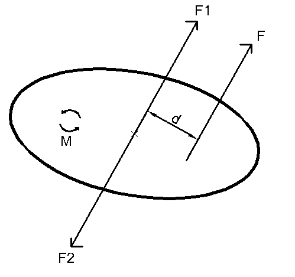

## 二、从三定律到理论力学

1.1 质点受力分析
以平面问题为例，通常会在物体所在的空间建立一个直角坐标系oxy，其中x代表质点的横坐标，y代表质点的纵坐标，根据我们要分析的质点的状态，先列出所有力的大小和方向
常见的力：支持力、摩擦力、重力、弹力等，都有不同的分析方法
分析质点力时可以将所有力画在质点上

- 支持力：$F_N$一般指抵抗重力的来自地面的力，也可指物体间抵抗冲突的力
- 摩擦力：粗糙表面的力，分为静摩擦力和动摩擦力，静摩擦力需要其他力才能计算，动摩擦力$f=\mu F_N$
- 重力：$G=mg$
- 弹簧的弹力：$F=-k\Delta x$
- 拉力：T

1.2 质点运动方程
求解质点运动方程的最终目的是求出位置关于时间的函数，由于某些原因，前面分析出来的力刚好是质点位置对时间的二阶导数乘以质量，即： $F=m\frac{d^2u}{dt^2}$
- 参考例题2，列出飞行时受力G，建立合适的坐标系（这里选择沿斜面建系），计算出力和初值状态在xy轴上的分量

$\begin{cases} G_x=-mg\sin (\theta_1)\\G_y=mg\cos (\theta_1)\\ \theta_3 = \frac{\pi}{2}-\theta_1+\theta_2 \\v_{0x}=v_0\cos (\theta_3) \\ v_{0y}=v_0\sin (\theta_3)\end{cases}$
- 根据受力分析，列出xy方向的运动方程并将F展开为：$F_u = ma = m \frac{d^2u}{dt^2}$(u为对应坐标方向)
$\begin{cases} \frac{d^2x}{dt^2}=-g\sin (\theta_1)\\\frac{d^2y}{dt^2}=g\cos (\theta_1)\end{cases}$
- 求解微分方程并带入初始条件，解得：
$\begin{cases} x=-\frac{1}{2}g\sin (\theta_1)t^2+v_{0x}t \\ y=\frac{1}{2}g\cos (\theta_1)t^2+v_{0y}t\end{cases}$
- 对于题目要求，可以先求出$\frac{dv_y}{dt}=0时t的值并带入求y即可$

1.3 恒功率启动

（恒功率指牵引力F=P/v）这里介绍常用微分变换：
$加速度a = \frac{d^2s}{dt^2} = \frac{dv}{dt} \\ 速度v=\frac{ds}{dt} \\\frac{a}{v} = \frac{dv}{dt} * \frac{dt}{ds} = \frac{dv}{ds} $
- 建系：不考虑y轴上的运动，向右为x轴
- 列运动方程：
$\frac{d^2x}{dt^2} = \frac{P}{mv} -> \frac{dv}{dt} = \frac{P}{mv}$
可得$\frac{1}{2}mv^2=Pt -> v=\sqrt \frac{2Pt}{m}$

1.4 动量和能量
在某些情况下比解运动方程要快
例：恒功率启动：
能量=Pt=动能=$\frac{mv^2}{2}$
可以跳过方程求解
- 动能=$\frac{1}{2}mv^2=Fl=Pt$,动量=$mv=Ft$

2.1分析力学-刚体受力
（在平面内）物体认为是不会发生变形的刚体，物体受到的力不经过质心时就会使刚体发生旋转

例：当物体只受到力F时，不仅质心会产生向右上的加速度，还会受到一个力矩$M_1=d*F$其中d为力到质心的距离
- 向物体质心添加一对虚拟力$F_1=-F_2=F$等大反向完全抵消，不会影响物体受力状态，而F和$F_2$大小相等，方向相反且平行，间距为d，可以用力力偶$M=F*d$表示（和力矩一样），通过这种操作，可以将刚体上的力转化为通过质心的力和力偶。而且这种方法可以将平面内一刚体上任意多的力转化为最多一个质心力和一个力偶
- 力偶可以在同一物体内任意平移，力只能在同一物体上沿力的方向前后平移

2.2 受力分析
- 刚体间相互连接分为几种方式，刚体上的力也通过不同的连接方式以不同方式传播
常见连接方式：固接、铰接
固接可以传递力和力偶，铰接只能传递力
- 点面接触时力与接触面向垂直

2.3 运动方程
- 就如同质点运动方程一样，力偶=转动惯量*角度的二阶导数$M=I*\frac{d^2\theta}{dt^2}=I*\frac{d\omega}{dt}$
- 转动惯量与物体的质量分布、形状有关（补图
- 平移轴定理：
- 例题：卷纸掉落

$F = \rho l,M=FR \\ \frac{d^2\theta}{dt^2}*I=\rho lg \\ \frac{dl}{dt}=v=\frac{d\theta}{dt}*R$
$\frac{d^2l}{dt^2} = \frac{\rho lg}{IR} \\ l=C_1\exp(\sqrt \frac{\rho}{IR} t)+l_0$
2.4 角动量和角动能
- 角动能=$\frac{1}{2}I\omega ^2=M*\theta$,角动量=$I\omega=Mt$
例题（暂无
3.1 达朗贝尔原理与拉格朗日方程
- 达朗贝尔原理:略(滑轮组的例题)
- 拉格朗日量：$L=T-V$
- 拉格朗日方程：$\frac{d}{dt}(\frac{dL}{d\dot q})=\frac{dl}{dq}$
- 例题：单摆（使用牛顿法和拉格朗日（改成双摆

- 牛顿法：建立坐标系$\theta$
受力分析：$\ddot \theta = \frac{a}{l} = \frac{g}{l}\sin(\theta)$
- 拉格朗日法：
L=动能-势能 = $\frac{1}{2}m\omega^2l^2-mgl(1-\cos(\theta))$
带入L方程$\frac{d}{dt}(\frac{dL}{d\dot \theta}) = m\ddot \theta l^2,\frac{dl}{d\theta} = -\sin(\theta)mgl \\ \ddot \theta = \frac{g}{l}\sin(\theta)$