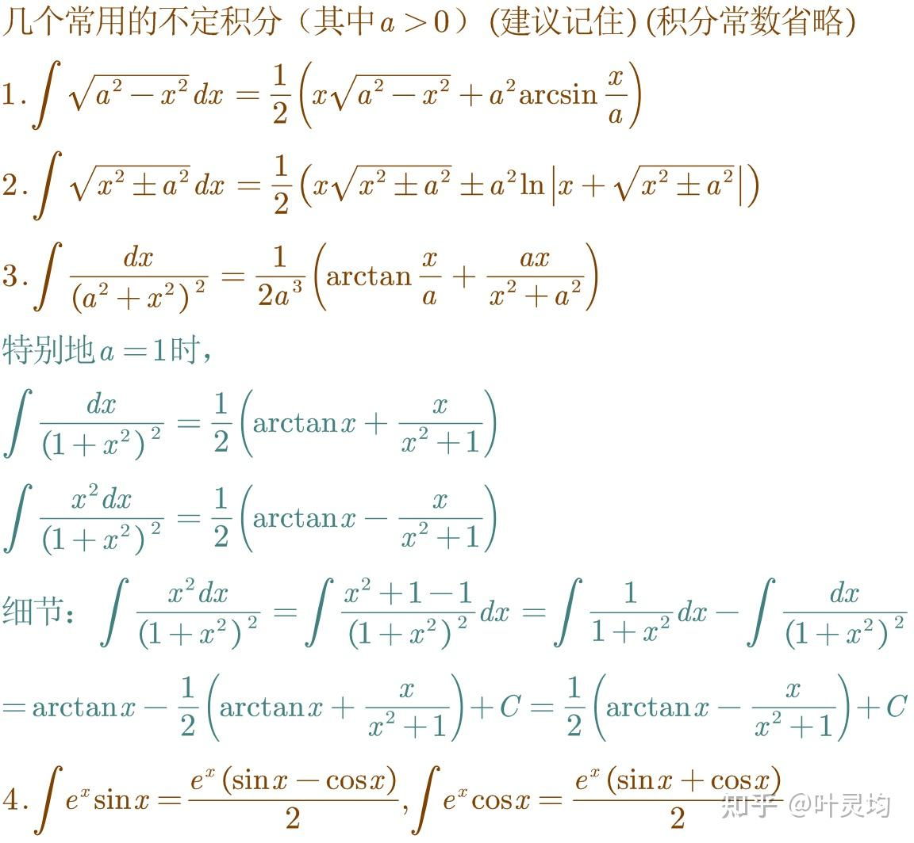

本指南将作为中学内容和工程实际的过渡教程
（以及markdown使用练习（未完工 禁止外传（丢人
（暂未分章节（工科数学 不会太严谨（已经忘记初中学到哪里了
## 零基础符号和写法
1. 三角函数:sin、cos...(6个)*2(反函数)*2(双曲函数)
1.2 合角、差角、周期、半角、二倍角、和积化差、万能公式、诱导公式、三角恒等式、积化和差…
1.3 差频公式
2. 积分:$I$,微分$D$
3. $\exp(x) \equiv e^x |\sum^n_{i=0} \equiv \sum^n_i|\sum^{n=\infty}_{i=0} \equiv \sum^\infty_i$
4. 常见非初等函数:$Li(x)、Si(x)、erf(x)、F(k,\phi)、E(k,\phi)、\pi(n,k,x)$
## 一、高数？速通！
1. 函数:对于给定输入,具有特定输出的东西,输入和输出可以是数字,向量或函数本身
通常讨论的函数都认为是“好的”简单函数,具有特定的“好的”性质(连续,可导…)
1.5. 这里还用讲极限吗？感觉没必要
2. 导数(微分)
	1. 导数定义
	对于一元函数$y=f(x)$它的导数可写作:$f'(x) = \frac{dy}{dx}or\frac{df(x)}{dx}or\frac{df}{dx}(x)$
	注:$dy \neq d*y$,而是一个整体可以理解为$d_yor.y_d or.d(y)$
	对于多元函数$z = f(x,y)$ 它对x的导数为$f'_x(x,y) = \frac{\partial (x,y)}{\partial x}$
	在物理中,如果函数变量包含t(时间)则$\dot f表示对t求导$
	导数的公式体现出了它的本质:两个东西相除
	例如:若$f(x) = \frac{dy}{dx},g(x)=\frac{dx}{dt}则f(x)*g(x) = \frac{dy*dx}{dx*dt}=\frac{dy}{dt}$被称作链式法则
	2. 导数的意义
	若在x=1时,f'(x)=2,是指y=2*(x-1)与f(x)在x=1处相切--------配图
	3. 导数的计算
	对于一元函数,$f'(x) = \frac{f(x+ \Delta x)}{\Delta x}当\Delta x足够小的时候的值,或写成\frac{f(x+ dx)}{dx}$
	可以通过这个公式推导出许多常见函数的导数公式,整理成导数表,暂略
	除了使用定义,还可以使用导数运算法则进行运算之后从网上找个md格式的教程cv过来
	
	4. 多次求导
	可写作$\frac{d(\frac{dy}{dx})}{dx}or\frac{d(dy)}{dx*dx}or\frac{d^2y}{(dx)^2}or\frac{d^2y}{dx^2}$
	同样遵守链式法则
	5. 隐函数求导和拉格朗日乘数法(暂略)
	6. 牛顿法(这些工程方法是在这里讲还是后面单开一章啊)
杂谈:通过$d(dy)=d^2y$可以看出$dy$并不只是代表$d_y$而是具有特殊的意义
3. 积分
	1. 积分定义
	是微分的逆运算如果$g(x)=f'(x)则f(x)=\int g(x)+C$其中$C$是一个常数
	或写作$F(x) = \int f(x)+C==F'(x)=f(x),F(x)$被称作原函数
	由于$f(x)=C$的导数$f'(x)=0$当于在求导时丢失了常数,在积分时需要将常数加回来,通常用给定的条件计算出C的值
	使用$\int f(x)$的是不定积分,需要求积分并加上C,使用$\int^a_bf(x)$的是定积分等于$F(a)-F(b)$常数会被抵消
	注:有些函数的不定积分是十分困难的,甚至可以证明它的积分不能用简单函数表示出来(或叫作不可求),但定积分可能可以求出来
	2. 积分的意义--------配图
	3. 积分的计算:使用3个公式(暂略),查表,其他高级方法,wolfram alpha
	(核心思想是设$f(x) =  \exp(g(x))$,带入微分方程求g(x)所符合的性质)
	
	
	4. 多重积分

3.5. 之后这里补上微分方程吧

4. 常用技术(泰勒展开,傅里叶变换……)
	1. 泰勒展开
	将函数f(x)在$x = x_0$处展开为关于x的n次多项式p(x)使得$f^{(n)}(x_0) = p^{(n)}(x_0)$
	可用p(x)近似f(x)
	若f(x)在x = $x_0$处n阶导数为$D^n_{x0}$,则$p(x+\Delta)$的n次项系数=$\frac{f^{(n)}(x_0)\Delta^i}{i!}$
	例如$sin(x)\approx x-\frac{x^3}{3!} + \frac{x^5}{5!}+…$
	可用于计算sin(x)的近似值(可参考https://netlib.org/fdlibm/s_sin.c)
	当以x=0为中心展开时,被称作麦克劳林展开
	(洛朗展开,收敛半径)
	2. 帕德逼近
	将函数f(x)在x = $x_0$处展开为$\frac{p_m(x)}{q_n(x)}$使得$f^{(n)}(x_0) = (\frac{p_m(x)}{q_n(x)})^{(n)}(x_0)$
	可用$\frac{p_m(x)}{q_n(x)}$近似f(x)
	(系数可由泰勒展开式系数求,暂略)
	例如$ln(x)\approx \frac{x^2-1}{2x}$
	对于ln(x)、1/x等特殊函数近似效果和需要的计算量比泰勒展开小
	3. Remes算法
	可用于计算函数近似值(可参考https://netlib.org/fdlibm/e_log.c)
	4. 实函数傅里叶变换
	假设f(x)为周期函数,周期为$2\pi$,可表示为$f(x) = A_0+\sum_{n=1}^\infty a_i*\sin(nx)+b_i*\cos(nx)$其中$a_i,b_i$为正弦傅里叶系数和余弦傅里叶系数
	由于三角函数的正交性:
	$$
	\int^\pi_{-\pi}\sin nxdx = 0\\
	\int^\pi_{-\pi}\cos nxdx = 0\\
	\int^\pi_{-\pi}\sin kx*\cos nxdx = 0\\
	\int^\pi_{-\pi}\sin kx*\sin nxdx = 0\\
	\int^\pi_{-\pi}\cos kx*\cos nxdx = 0\\
	(k,n=1,2,3…,k\neq n)\\
	(证明略)
	$$
	那么$\int^\pi_{-\pi}f(x)*\sin kxdx = \int^\pi_{-\pi}a_n*\sin^2 (kx)dx = a_n\pi$
	(用法类似量力中的$\delta_{ij}$)
	整理可得$a_n = \frac{1}{\pi}\int^\pi_{-\pi}f(x)*\sin nxdx$
	$b_n = \frac{1}{\pi}\int^\pi_{-\pi}f(x)*\cos nxdx$
	5. 使用$\mathcal{F(x),L(x)}$解微分方程(数学物理方法)(暂略)
	
## 向量与矩阵,（可参考3B1B的教程）
(放在高数前面更合适吧)
1. 向量(Vector)
	1. 概念:向量是常量的有序集合，通常用符号$\mathbf{u}或\overrightarrow{u}$表示(好长)
	有两种常见的写法:
	$$
	行向量:(a_1,a_2,a_3...a_n)\\
	列向量:\left[
		\begin{array}{c}
		a_1\\
		a_1\\
		...\\
		a_n
		\end{array}
		\right]\\
		或者节约空间，写成(a_1,a_2,a_3...a_n)^T\\
	$$
	其中$a_n$为向量的第n个分量
	(除了中学中的“矢量”,一般都用列向量的两种方式表示)
	(本文中所有向量均为列向量)
	向量具有几何意义，但一般只在二维直角系、三维直角系中讨论
	2. 向量具有如下常用运算:
	$$
	加法:\mathbf{p=u+v}->p_n=u_n+v_n\\
	减法:\mathbf{p=u-v}->p_n=u_n-v_n\\
	数乘:\overrightarrow{p}=a * \overrightarrow{u}->p_n=a*u_n\\
	点乘:p = \mathbf{u\cdot v}->p=\sum_i^n u_i*v_i\\
	p范数:p =  \mathbf{\parallel u\parallel_p} = (\sum_i^nu_i^n)^\frac{1}{p}\\
	三维叉乘:\mathbf{p=u\times v} = \left|\begin{matrix}
		i&j&k\\
		u_1&u_2&u_3\\
		v_1&v_2&v_3
		\end{matrix}\right|->
		\\p_1=(u_2v_3-v_2u_3)
		\\p_2=(u_3v_1-u_1v_3)
		\\p_3=(u_1v_2-u_2v_1)k\\
	二维叉乘:\mathbf{p=u\times v} = u_1v2-u_2v_1
	$$
	补充:常用范数:
	$$
	\mathbf{\parallel u\parallel_0} = u的维度数(分量数)\\
	\mathbf{\parallel u\parallel_1} = 各分量绝对值之和\\
	\mathbf{\parallel u\parallel_2} = L_2长度\\
	\mathbf{\parallel u\parallel_\infty} = 分量的绝对值的最大值
	$$
	3. 几何意义…(这里证下余弦差角公式)
2. 矩阵Matrix
	1. 定义:m*n矩阵指有m行、n列的矩阵
	通常写作：
	$\left[\begin{matrix}
		m_{1,1}&m_{1,2}&m_{1,3}\\
		&...\\
		&...\\
		\end{matrix}\right]$
	2. 运算:除了常规的加、减、数乘以外:
	$$
	左乘、右乘、转置、逆、行列式、左逆、右逆、复合、分解(SVD、URL)、切片
	$$
	(太多了，暂略)
	3. 为什么要矩阵？
	如下线性方程组:
	$(排版麻烦，暂略)$
	可以用矩阵写成如下形式:
	$(排版麻烦，暂略)$
	抽象了问题，简化了写法，方便分析和运算
3. 课设实战(玻璃坯料方程求解、水泥生料配比计算)
$\theta_\theta$
## 复数和复函数
1. 复数基础:
	1. 定义:先定义虚数$\mathbf{i},符合\mathbf{i^2=-1}$
	那么复数定义为写成如下形式的数:$c=a+b\mathbf{i}$其中a为实部，b为虚部
	2. 运算:根据虚数$\mathbf{i}$的定义，复数有如下运算:
	$$
	Re(c) = \Re (c) = a\\
	Im(c)=\Im(c)=b\\
	加、减、乘、除、根号、指数、对数…
	$$
	3. 复数乘法的特殊之处(接余弦差角公式)……
	4. 对偶数……

碎碎念:
黄昆的《固体物理》里面解一维双原子链的矩阵的使用用的是什么变换来着？？？我课本早还图书馆了
近似阶跃函数:$\frac{1}{1+exp(-x)}$
近似max函数:$f(a,b) = ln(exp(a)+exp(b))$
$\sin(x)+\sin(x+ax) = \sin(x+\frac{ax}{2})*2\cos(\frac{ax}{2})$
$y =  \sqrt{-ax^2+\sqrt{1-ax^2}+1}$
$t = -\frac{m}{f^2}(p\ln(\frac{p-fv}{p}+fv))$
分贝(dB) = lg(x)/20
如:20dB = 10,40dB = 100,3dB $\approx \sqrt{2}$

计划项:
微积分:微分,积分,链式法则,微分方程,泰勒级数,数值积分,傅里叶
线代:简化
数学物理:保角变化,留数定理,三种方程,拉普拉斯变换
力学:力矩,力偶,欧拉刚体旋转方程,应力,应变,挠度,失稳,振动模态
热力学:热阻,传导,对流,辐射
水力学:水头,水损
电机学:磁链,磁场
电路:数电,模电
软件:Geogebra,calcbad,wolfram alpha
程序:cpp,java,glsl,julia,plc
机械:（不会
建筑:（不会
自动化控制:（不会
光学:几何光学,物理光学（不会
机械制图:画法几何,cad,catia
材料成型:（不会
硬件:pcb,pcba
航天:轨道计算,储罐应力计算,发动机计算
物理化学（不熟
概率论（不熟
材料分析方法
四大化学
四大材料
图论

$\theta$